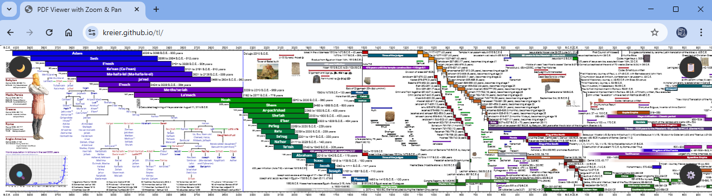

# Timeline on the web - tl

Interactive website version of my timeline project. The latest edition looks like this:

## Current timeline pdf

It looks like this:

## History

With vibe-coding I got a scalable version working, but pixelated and a far cry from my imagination. But it worked:

